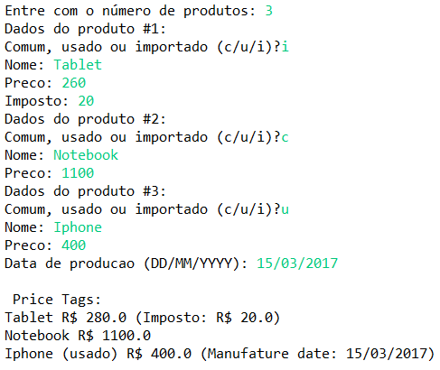
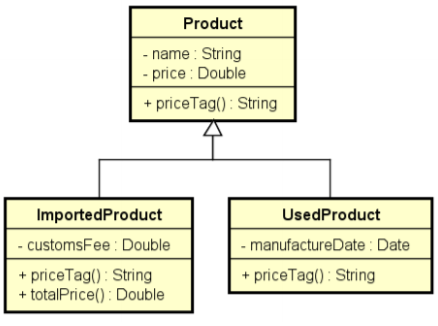

# curso-java-Polimorfismo

Códigos do curso online de java avançado na Udemy(https://www.udemy.com/share/1013hwA0cfdVlTQn4=/)

->Neste exercicio, foi criado uma classe base (Product) da qual outras duas classes herdam seus atributos e metodos (ImportedProduct e UsedProduct).

->Aproveitando o codigo, foi implementada uma redefinicao do metodo da classe base, nas filhas (metodo priceTag(), que eh semelhante a um metodo toString()), a fim de descontar uma taxa diferenciada para cada tipo de conta. Foi utilizada a palavra @override antes de redefinir o metodo nas classes base e utilizamos o metodo super dentro da classe filha, a fim de que ela repita o mesmo comportamento da mae e depois acrescente sua logica especifica.

No programa principal, sao criadas tres produtos, uma instancia de cada tipo de classe e eh atribuido um tipo de produto, para que a instancia de cada tipo, pudesse gerar uma saida diferente do metodo priceTag(). Como cada classe tem sua taxa diferenciada, a saida sera diferente para cada tipo de classe. Se a descricao nao ficou clara, o programa principal executa de acordo com o print do console demonstrado a seguir(Usando estes valores):

As classes foram implementadas seguindo o seguinte diagrama de Classes(Precisa so atualizar a imagem, para acrescentar o metodo withdraw na outra classe filha):

